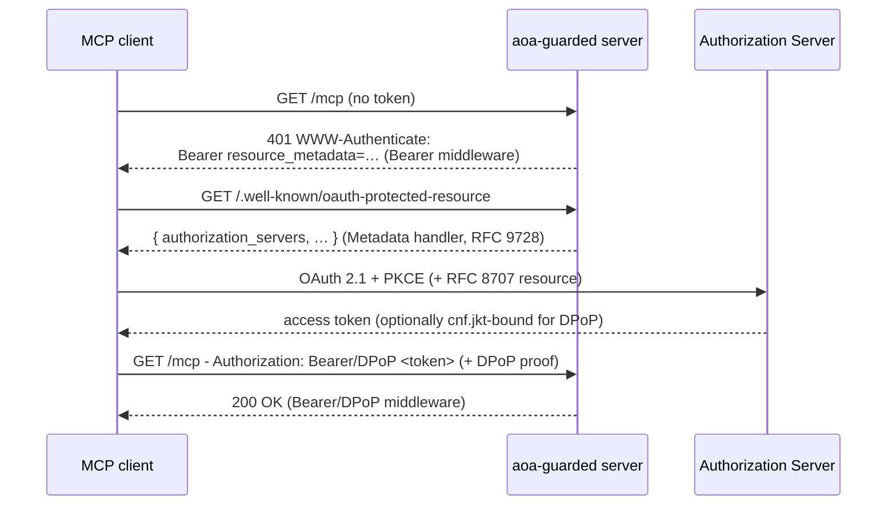

# agentOAuth

[](https://pkg.go.dev/github.com/0ndreu/aoa)
[](https://goreportcard.com/report/github.com/0ndreu/aoa)
[](go.mod)
[](LICENSE)

> OAuth 2.1 building blocks for MCP servers, written in Go.

```go
import "github.com/0ndreu/aoa"
```

## Why

The official [modelcontextprotocol/go-sdk](https://github.com/modelcontextprotocol/go-sdk) ships server-side auth (`RequireBearerToken`, a `TokenVerifier` interface, and RFC 9728 metadata) but does **no token validation itself**. The `TokenVerifier` is a bare callback the SDK hands the raw token: signature verification, `alg:none`/`HS*`-confusion defense, JWKS fetch/cache, `iss`, audience binding, and `exp`/`nbf` are all your job. That hand-rolled verifier is exactly where alg-confusion auth-bypass bugs come from.

`aoa` **is** that verifier, done fail-closed. Drop it into the SDK's `RequireBearerToken` seam and get hardened JWT validation and audience binding for free. On top of the mandatory resource-server loop (RFC 9728 metadata + RFC 6750/8707 Bearer), it adds the two RFCs the SDK has no support for at all: **DPoP** (RFC 9449, sender-constrained tokens) and **Token Exchange** (RFC 8693, delegation). It complements the SDK rather than replacing it.

Design principles:

- **One dependency.** The core depends only on `lestrrat-go/jwx` (and the Go stdlib). DPoP is hand-rolled on top of it, with no extra crypto packages and no vendoring.
- **No leaked types.** `jwx` is fully hidden behind `aoa`-owned types (`aoa.Claims`, `KeysJWKS []byte`, `ClaimValidator func(*Claims)`). A future JOSE swap stays an internal, non-breaking change; consumers never import `jwx`.
- **Fail closed.** alg-confusion, `none`, `HS*`, expired/`nbf`, wrong issuer/audience, spoofed `kid`, and malformed tokens all reject. A `cnf.jkt`-bound token is *never* accepted as a plain Bearer.
- **`net/http` first.** Everything is a standard `http.Handler` / middleware. Framework adapters (chi today) are thin and optional.

## How it fits together

The three components form the MCP discovery-and-authorization loop. An unauthenticated request is bounced with a pointer to the metadata, the client discovers its authorization server and gets a token, and the same request succeeds on retry:



A gateway that calls downstream tools on the user's behalf adds a fourth step, Token Exchange (RFC 8693): it mints a downscoped token from the user's token before forwarding the request.

### When do I need each piece?

The MCP authorization spec mandates only the first two; the rest are opt-in.

| Piece | Use it when | Required by MCP spec? |
|-------|-------------|-----------------------|
| **Metadata** (RFC 9728) | Always: it's how clients discover where to authenticate. | Yes |
| **Bearer** (RFC 6750 + 8707) | Always: validate the token on every protected request. | Yes |
| **DPoP** (RFC 9449) | You want sender-constrained tokens, so a stolen token is useless without the client's key. Opt in via the `DPoP` field. | No |
| **Token Exchange** (RFC 8693) | You run a gateway that must act on a user's behalf downstream with a downscoped token (delegation or impersonation). | No |

### How it compares to the SDK's `auth`

The official SDK does header extraction and a scope/expiry check, then delegates everything cryptographic to a `TokenVerifier` you supply. `aoa` is that verifier, hardened.

| | official `go-sdk` `auth` | `aoa` |
|---|:---:|:---:|
| Bearer extraction + scope check | ✅ | ✅ |
| RFC 9728 protected-resource metadata | ✅ | ✅ |
| Signature verification | ❌ (you write the `TokenVerifier`) | ✅ |
| `alg:none` / `HS*`-confusion defense | ❌ | ✅ |
| JWKS fetch + cache, `kid` lookup | ❌ | ✅ |
| `iss` / `nbf` / audience (RFC 8707) validation | ❌ | ✅ |
| DPoP (RFC 9449) | ❌ | ✅ |
| Token Exchange (RFC 8693) | ❌ | ✅ |

Plug `aoa` into the SDK's `RequireBearerToken` rather than replacing it.

## Status

| RFC | What | Status |
|-----|------|--------|
| [RFC 9728](https://www.rfc-editor.org/rfc/rfc9728) | Protected Resource Metadata | Done   |
| [RFC 6750](https://www.rfc-editor.org/rfc/rfc6750) + [RFC 8707](https://www.rfc-editor.org/rfc/rfc8707) | Bearer middleware + audience/scopes | Done    |
| [RFC 9449](https://www.rfc-editor.org/rfc/rfc9449) | DPoP sender-constrained tokens | Done    |
| [RFC 8693](https://www.rfc-editor.org/rfc/rfc8693) | OAuth 2.0 Token Exchange | Done    |

## Install

```bash
go get github.com/0ndreu/aoa@latest
```

Requires Go 1.25+.

> **Stability:** `aoa` is pre-1.0 (`v0.x`). The API may change between minor versions until `v1.0.0`; breaking changes bump the minor version and are noted in release notes. Report security issues via [`SECURITY.md`](SECURITY.md).

## Usage

Serve metadata so clients can discover your authorization server, guard your MCP routes with the Bearer/DPoP middleware, and, if you run a gateway, exchange tokens for downscoped downstream credentials.

### 1. Protected Resource Metadata (RFC 9728)

Advertise your resource and its authorization server(s) at the well-known endpoint.

```go
package main

import (
    "log"
    "net/http"

    "github.com/0ndreu/aoa"
)

func main() {
    meta := aoa.ProtectedResourceMetadata{
        Resource:             "https://mcp.example.com",
        AuthorizationServers: []string{"https://idp.example.com"},
        ScopesSupported:      []string{"mcp:read", "mcp:write"},
    }
    h, err := aoa.NewMetadataHandler(meta, aoa.HandlerOptions{})
    if err != nil {
        log.Fatal(err)
    }
    path, err := aoa.MetadataPathFor(meta.Resource)
    if err != nil {
        log.Fatal(err)
    }

    mux := http.NewServeMux()
    mux.Handle(path, h)
    log.Fatal(http.ListenAndServe(":8080", mux))
}
```

The metadata is served at `aoa.MetadataPathFor(resource)`. For a path-less resource this equals `aoa.WellKnownSuffix`; for a resource with a path (e.g. `https://mcp.example.com/api`) it appends the path per RFC 9728 §3.1.

`Validate()` is strict-RFC by default (https-only, no fragment). For dev validation alone, use `ValidateWithOptions(aoa.ValidateOptions{AllowInsecureLocalhost: true})`.

**Handler options:**

```go
aoa.HandlerOptions{
    AllowInsecureLocalhost: true,        // dev/test only; http://localhost permitted
    EnableCORS:             true,        // permissive CORS for browser MCP clients
    CacheControl:           "no-store",  // overrides default "public, max-age=3600"
}
```

See the [`ProtectedResourceMetadata` GoDoc](https://pkg.go.dev/github.com/0ndreu/aoa#ProtectedResourceMetadata) for every RFC 9728 field (`JWKSURI`, `DPoPSigningAlgValuesSupported`, etc.). Extension fields go in `Extra` and are merged into the JSON output without overriding typed fields.

**With chi:**

```go
import (
    "github.com/go-chi/chi/v5"
    "github.com/0ndreu/aoa"
    chiadapter "github.com/0ndreu/aoa/adapters/chi"
)

r := chi.NewRouter()
chiadapter.Mount(r, aoa.ProtectedResourceMetadata{
    Resource: "https://mcp.example.com",
}, aoa.HandlerOptions{})
```

### 2. Bearer middleware (RFC 6750 + RFC 8707)

`RequireBearer` returns standard `net/http` middleware. It verifies the JWT signature against your authorization server's JWKS, enforces issuer/audience/scopes, and on failure emits a `WWW-Authenticate` header carrying a `resource_metadata` hint that points clients back at the metadata handler above, completing the MCP discovery loop.

```go
guard, err := aoa.RequireBearer(aoa.BearerOpts{
    Resource:       "https://mcp.example.com",
    Issuer:         "https://idp.example.com",
    JWKSURI:        "https://idp.example.com/.well-known/jwks.json",
    RequiredScopes: []string{"mcp:read"}, // ALL must be present
})
if err != nil {
    log.Fatal(err)
}

mux.Handle("/mcp", guard(http.HandlerFunc(func(w http.ResponseWriter, r *http.Request) {
    claims, _ := aoa.ClaimsFromContext(r.Context())
    fmt.Fprintln(w, "authorized:", claims.Subject)
})))
```

Verified claims are placed on the request context; retrieve them with `aoa.ClaimsFromContext`. Decode custom claims with `claims.Decode(&myStruct)`.

Common `BearerOpts` knobs:

```go
aoa.BearerOpts{
    KeysJWKS:          jwksJSON,            // static JWKS bytes instead of JWKSURI
    Audience:          []string{"..."},     // explicit audience(s); Resource is also accepted as one
    AllowedAlgorithms: []string{"RS256"},   // access-token signature allowlist
    ClockSkew:         30 * time.Second,
    JWKSCacheTTL:      5 * time.Minute,      // remote JWKS refresh interval
    ClaimValidator:    func(c *aoa.Claims) error { /* extra checks */ return nil },
    AuditEmitter:      aoa.LogEmitter(slog.Default()),
}
```

### 3. DPoP: sender-constrained tokens (RFC 9449)

DPoP binds an access token to a client-held key, so a stolen token is useless without the corresponding private key. Turn it on with the `DPoP` field on the same `BearerOpts`:

```go
guard, err := aoa.RequireBearer(aoa.BearerOpts{
    Resource: "https://mcp.example.com",
    Issuer:   "https://idp.example.com",
    JWKSURI:  "https://idp.example.com/.well-known/jwks.json",

    DPoP: aoa.DPoPRequired, // DPoPOff (default) | DPoPOptional | DPoPRequired
})
```

The middleware verifies the `DPoP` proof header, checks it against the token's `cnf.jkt` binding and the request method/URL (`htu`/`htm`) and access-token hash (`ath`), and rejects replays. The load-bearing rule, and the downgrade defense: a `cnf.jkt`-bound token is never accepted as plain Bearer, in any mode.

**Replay protection.** By default `jti` values are tracked in an in-memory TTL cache, which is correct for a single instance. For multi-instance deployments supply a shared `DPoPReplayCache`. A Redis reference implementation (`SET NX PX`) lives in [`examples/dpop-redis`](examples/dpop-redis/main.go):

```go
aoa.BearerOpts{
    DPoP:       aoa.DPoPRequired,
    DPoPReplay: myRedisReplayCache, // satisfies aoa.DPoPReplayCache
}
```

**Server nonce.** To require a server-issued nonce (`use_dpop_nonce` challenge), supply a `DPoPNonceSource`. `NewDPoPNonceSource(secret)` returns a stateless HMAC source that is multi-instance-safe with no shared store:

```go
aoa.BearerOpts{
    DPoP:      aoa.DPoPRequired,
    DPoPNonce: aoa.NewDPoPNonceSource([]byte(os.Getenv("DPOP_NONCE_SECRET"))),
}
```

Other DPoP options: `DPoPSigningAlgs` (proof-algorithm allowlist, default `ES256`/`RS256`/`EdDSA`; `none` and `HS*` always rejected), `DPoPProofMaxAge` (default 60s), and `TrustForwardedHeaders` (derive `htu` from `X-Forwarded-*`; enable only behind a trusted proxy). See the end-to-end demo in [`examples/dpop`](examples/dpop/main.go).

### 4. Token Exchange (RFC 8693)

#### Client: minting a downstream token

A gateway holding a user's access token can exchange it for a downscoped token aimed at a specific downstream tool (the agent -> user -> tool delegation flow):

```go
x, err := aoa.NewTokenExchanger(aoa.ExchangeConfig{
    TokenEndpoint: "https://idp.example.com/token", // or set Issuer for RFC 8414 discovery
    ClientAuth:    aoa.ClientSecretAuth("mcp-gateway", secret, true /* post */),
})
if err != nil {
    log.Fatal(err)
}

res, err := x.Exchange(ctx, aoa.ExchangeRequest{
    SubjectToken:     userAccessToken,
    SubjectTokenType: aoa.TokenTypeAccessToken,
    Audience:         []string{"https://tool.example.com"},
    Scope:            []string{"tool:invoke"},
})
if err != nil {
    log.Fatal(err)
}
fmt.Println(res.AccessToken) // downscoped token for the downstream tool
```

Client authentication is pluggable: `ClientSecretAuth(id, secret, post)` or `PrivateKeyJWTAuth(id, key, alg)`. The default HTTP client deliberately doesn't follow redirects, so credentials are never replayed to a redirected host.

**DPoP-bound exchange.** Set `DPoPKey` to request a sender-constrained downstream token; nonce challenges are handled automatically:

```go
dpopKey, _ := aoa.NewDPoPKey(ecP256PKCS8PEM)
x, _ := aoa.NewTokenExchanger(aoa.ExchangeConfig{
    TokenEndpoint: endpoint,
    ClientAuth:    aoa.ClientSecretAuth("mcp-gateway", secret, true),
    DPoPKey:       dpopKey,
})
```

See [`examples/token-exchange`](examples/token-exchange/main.go) and [`examples/token-exchange-dpop`](examples/token-exchange-dpop/main.go) (both run against Keycloak).

#### Server: validating an exchange request

If you operate the security token service, `ExchangeValidator` validates an incoming RFC 8693 request and hands you a typed `ExchangeGrant` to authorize and turn into a token. Set `Audience` to your STS's own identifier(s) so tokens minted for other resources can't be exchanged here.

```go
v, err := aoa.NewExchangeValidator(aoa.ExchangeValidatorOptions{
    JWKSURI:  "https://idp.example.com/.well-known/jwks.json",
    Issuer:   "https://idp.example.com",
    Audience: []string{"https://sts.example.com"}, // strongly recommended
    Policy:   myExchangePolicy,                    // optional Authorize(ctx, *ExchangeGrant) error
})
if err != nil {
    log.Fatal(err)
}

http.HandleFunc("/token", func(w http.ResponseWriter, r *http.Request) {
    grant, err := v.Validate(r.Context(), r)
    if err != nil {
        // err already carries the RFC 6749/8693 error response
        return
    }

    // grant.Subject / grant.Actor / grant.IsDelegation describe the request.
    // Mint your token here (the Act chain and cnf are pre-computed on the grant),
    // then write the RFC 8693 response:
    _ = aoa.WriteExchangeResponse(w, aoa.IssuedToken{
        AccessToken:     signedToken,
        IssuedTokenType: aoa.TokenTypeAccessToken,
        TokenType:       "Bearer", // or "DPoP"
        ExpiresIn:       5 * time.Minute,
        Scope:           grant.RequestedScope,
    })
})
```

`ExchangeGrant` distinguishes **delegation** (an actor token is present, and `Act` holds the nested chain) from **impersonation** (no actor). `Confirmation` carries the `cnf.jkt` to embed when binding the new token.

### Audit / observability

Every component accepts an `Emitter` (`AuditEmitter` on `BearerOpts`, `Audit` on the exchange types). It receives typed `Event`s (`token_validated`, `token_rejected`, `token_exchanged`, `dpop_verified`, `dpop_rejected`, `jti_replay`, `metadata_served`) with no PII in the payload. The default is a no-op.

```go
aoa.BearerOpts{
    AuditEmitter: aoa.LogEmitter(slog.Default()),
}

// or a custom sink:
aoa.BearerOpts{
    AuditEmitter: aoa.FuncEmitter(func(ctx context.Context, e aoa.Event) {
        metrics.Count("auth."+string(e.Kind), e.Outcome)
    }),
}
```

## Examples

Runnable programs under [`examples/`](examples/):

| Example | Shows |
|---------|-------|
| [`metadata-nethttp`](examples/metadata-nethttp) / [`metadata-chi`](examples/metadata-chi) | RFC 9728 metadata endpoint |
| [`bearer-nethttp`](examples/bearer-nethttp) / [`bearer-chi`](examples/bearer-chi) | Bearer guard + live discovery loop |
| [`dpop`](examples/dpop) | End-to-end DPoP (proof -> 200, replayed-as-Bearer -> 401) |
| [`dpop-redis`](examples/dpop-redis) | Multi-instance replay cache reference |
| [`token-exchange`](examples/token-exchange) | RFC 8693 client (Keycloak) |
| [`token-exchange-dpop`](examples/token-exchange-dpop) | DPoP-bound exchange (Keycloak) |

## Provider compatibility

`aoa` validates standard OAuth 2.1 / JOSE artifacts, so it works with any spec-compliant authorization server. Concretely:

- **Keycloak 26.2**: validated end-to-end by the standalone [`aoa-conformance`](https://github.com/0ndreu/aoa-conformance) suite (RFC 9728 discovery, Bearer/DPoP challenges, and the RFC 8693 exchange against a live server). See its [Keycloak pipeline](https://github.com/0ndreu/aoa-conformance/blob/main/docs/keycloak-stack.md).
- **Auth0 / Okta** and other IdPs that publish JWKS without an `alg` on each key are handled: the algorithm is inferred from the key type, so alg-less JWKS verify correctly instead of rejecting everything.
- Anything exposing a standard JWKS endpoint (set `JWKSURI`) or RFC 8414 metadata (set `Issuer` for discovery) should work; pin the accepted signature algorithms with `AllowedAlgorithms` for defense in depth.

## Security

`aoa` is built to fail closed. Token verification rejects the classic attacks rather than trusting attacker-controlled input:

- **Algorithm attacks**: `none`, symmetric `HS*` against an asymmetric key (alg-confusion), and any algorithm outside `AllowedAlgorithms` are rejected. The signing algorithm is taken from the trusted JWKS, never from the token header alone.
- **Claim validation**: expired (`exp`), not-yet-valid (`nbf`), wrong `iss`, and wrong `aud` (RFC 8707 audience binding) all reject. Spoofed-`kid` and malformed tokens fail closed.
- **DPoP downgrade defense**: a `cnf.jkt`-bound token is never accepted as a plain Bearer, in any mode. Possession of the bound key is required, so a leaked DPoP-bound token can't be downgraded to bearer use.
- **Replay protection**: DPoP `jti` values are tracked (in-memory by default, pluggable for multi-instance), and proofs are bound to the request method/URL (`htm`/`htu`) and access-token hash (`ath`). An optional stateless HMAC nonce (`use_dpop_nonce`) adds a server-issued challenge with no shared store.
- **Credential exfiltration**: the token-exchange client doesn't follow redirects from the token endpoint, so credentials (`subject_token`, `client_secret`, `client_assertion`) are never replayed to a redirected host. A custom `HTTPClient` should preserve this with `CheckRedirect: http.ErrUseLastResponse`.
- **Exchange audience restriction**: set `ExchangeValidatorOptions.Audience` to your STS's own identifier(s) so a token minted for another resource cannot be exchanged at your endpoint (RFC 9700).

These properties are covered by the test suite, including adversarial cases.

> ⚠️ `aoa` is pre-release and has not yet had an external security audit. Review it for your own threat model before production use.

### What's tested

- **Validation matrix (unit):** alg-confusion (`none`, `HS*` against an asymmetric key), `exp`/`nbf`/`iss`/`aud`, spoofed `kid`, malformed tokens, DPoP proof + `cnf.jkt` binding, `jti` replay, and the RFC 8693 grant / `may_act` logic, including adversarial cases.
- **Fuzzing:** the four highest-risk components (the JWT header reader, the DPoP proof parser, the replay cache, and the token-exchange request parser) have Go native fuzz tests (`Fuzz*`). Their seed corpora run on every `go test`.
- **Integration / conformance:** validated end-to-end against live Keycloak 26.2 by the standalone [`aoa-conformance`](https://github.com/0ndreu/aoa-conformance) suite (RFC 9728 discovery, Bearer/DPoP challenges, RFC 8693 exchange, agent-loop). The client/server exchange logic is additionally unit-tested with httptest mocks.

### Reporting a vulnerability

Please report security issues **privately**: see [`SECURITY.md`](SECURITY.md). Do not open a public issue for a vulnerability.

## Implemented

- RFC 9728 Protected Resource Metadata
- RFC 6750 Bearer middleware + RFC 8707 audience + scopes; `WWW-Authenticate` PRM discovery; net/http + chi examples
- RFC 9449 DPoP: sender-constrained tokens; proof verification + `cnf.jkt` binding; `jti` replay cache (pluggable) + stateless HMAC nonce
- RFC 8693 OAuth 2.0 Token Exchange: client `TokenExchanger` + server-side `ExchangeValidator`

## Contributing

Issues and PRs welcome. Run the suite locally:

```bash
go test -race ./...        # unit tests + fuzz seed corpora
golangci-lint run ./...    # lint
```

Live Keycloak conformance testing lives in the separate [`aoa-conformance`](https://github.com/0ndreu/aoa-conformance) repo. For security issues, follow [`SECURITY.md`](SECURITY.md) (private disclosure) rather than opening a public issue.

## License

Apache-2.0. See [LICENSE](LICENSE).
